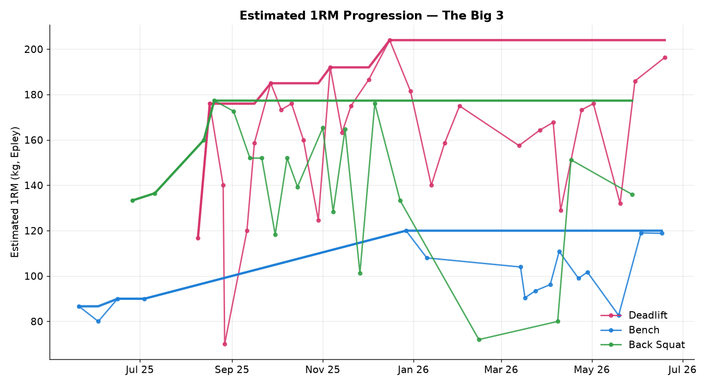
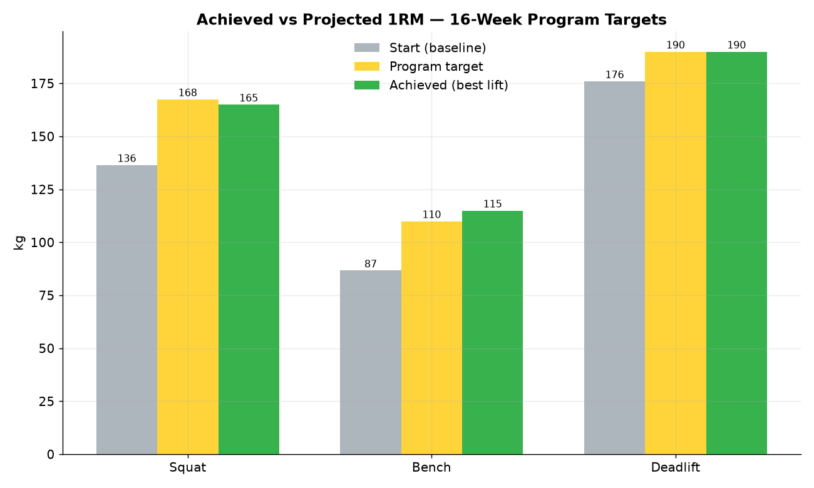
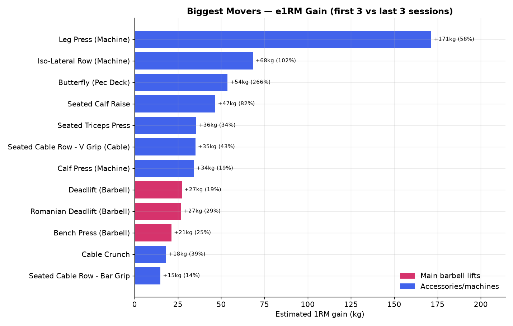
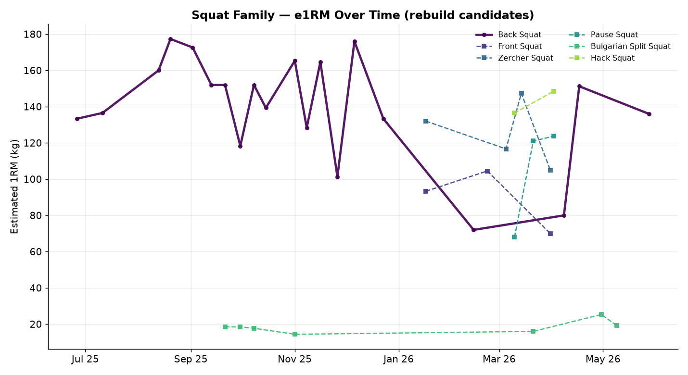

# Training Review & Next Phase Plan

**Period analysed:** 21 May 2025 → 19 Jun 2026 (~56 weeks, 125 logged sessions, ~2.2/week, ~900 tonnes moved)
**Source:** Hevy export (`Workout_Data.csv`) vs `16-week-powerlifting-phase1.csv`
**Estimated 1RMs (e1RM)** use the Epley formula `weight × (1 + reps/30)`.

---

## 1. Headline results vs the program targets

| Lift | Baseline (start) | Program target (PR-test) | **Achieved (best single)** | Verdict |
|------|------------------|--------------------------|----------------------------|---------|
| **Deadlift** | ~176 e1RM | 185 / **190** | **190 kg** (19 Jun 2026) | ✅ Hit the top "optional 2nd attempt" |
| **Bench** | ~87 e1RM | 107.5 / 110 | **115 kg** (17 Jun 2026) | ✅ **+5 kg above** best-case projection |
| **Squat** | ~137 e1RM | 162.5 / 167.5 | 165 × 2 (~177 e1RM), no formal test | ⚠️ Stalled — back pain, last session 28 May 2026 |



The bold lines are the running best e1RM; the faint markers are each session's top set. Deadlift e1RM peaked even higher than the 190 single (204 from 180×4 in Dec) — you have rep-strength in the tank above the tested single. Bench was the cleanest, most linear progression of the three.



**Bottom line:** deadlift landed exactly on plan, bench beat the plan, and squat is the only unfinished business — and that's a back-health story, not a strength one.

---

## 2. Biggest movers



Among the **main barbell lifts**, e1RM gains (first 3 vs last 3 sessions) were Deadlift **+27 kg**, RDL **+27 kg**, Bench **+21 kg**, Barbell Row **+18 kg**. The largest raw movers were accessories that started from a deliberately light base (Leg Press +171, Iso-Row +68, Pec Deck +54) — useful for hypertrophy, but the barbell numbers are the ones that carried the program.

---

## 3. The squat situation



Back squat climbed to ~177 e1RM (165×2) by Dec 2025, then became inconsistent and stopped entirely on **28 May 2026** due to back pain. The good news: your **squat-pattern variations held up well** even in the back-half of the year — Hack Squat (135×3, ~148 e1RM), Zercher (140×1, ~147), Pause Squat (112×3, ~124). Bulgarian Split Squats have only ever been done light (≤20 kg), so there's easy, low-risk progress to be made there.

That's the basis for the rebuild: we don't restart from zero, we restart the **barbell axial loading** from a conservative point while keeping the leg strength you already built.

---

## 4. Next phase — design decisions

Two choices drive the new block (confirmed with you):

- **Primary squat = High-Bar Back Squat**, rebuilt from a deliberately conservative Training Max so the spine reloads gradually. High-bar keeps a more upright torso than your old low-bar competition squat.
- **Training Maxes built from tested maxes** so the program's percentages run off real numbers and the peak naturally pushes *past* them.

### New Training Maxes

| Lift | Old TM | **New TM** | Week-13 work-up | Week-14 PR test (103% / 106%) |
|------|--------|-----------|-----------------|-------------------------------|
| Deadlift | 180 | **190** | 190 | **195 / 202.5** |
| Bench | 102.5 | **115** | 115 | **117.5 / 122.5** |
| High-Bar Squat | 157.5 (low-bar) | **120** | 120 | **122.5 / 127.5** |

The deadlift and bench peaks (up to **202.5** and **122.5**) are exactly the "push higher" you asked for. The squat TM is intentionally well below your historical ~177 e1RM — the goal this block is *pain-free re-grooving*, not a squat PR.

### What changed structurally vs Phase 1

- **Low-bar "Back Squat" → "High Bar Squat"** everywhere it was the main lift, run off the 120 TM.
- **Bulgarian Split Squats added** to every working squat day (progressing 20 → 30 kg per leg) — back-sparing unilateral quad volume.
- **Front Squat** (Volume day) given its own sensible progression (70 → 80 kg) instead of inheriting the low rebuild TM, since your front squat is already strong.
- Early-block squatting stays on **Pause Squats (high-bar)** for technique before the main high-bar work ramps up.
- Everything else (the 4-week Light/Medium/Heavy/Deload waves, the peaking weeks, the bench/deadlift accessory menu) is preserved from the proven Phase 1 template.

---

## 5. How to run the new phase

The new program is `16-week-powerlifting-phase2.csv` and plugs into the existing Hevy importer:

```bash
# Preview without writing to Hevy
pnpm start:powerlifting-phase2 --dry-run

# Import a single week (recommended, to respect Hevy rate limits)
pnpm start:powerlifting-phase2 --week 1

# Or a range
pnpm start:powerlifting-phase2 --week 1-4
```

It's also selectable via `--program powerlifting-phase2` on the underlying CLI, and the **Sync Hevy Routines** GitHub Action picks it up the same way as the other programs.

> **Back-health note:** the squat TM is a starting estimate. If week-1 high-bar work feels easy and pain-free, nudge the TM up 5 kg before week 5; if anything aggravates the back, drop the High Bar Squat for Front Squat / Bulgarian Split Squat from the same percentages and keep building the variations until you're confident reloading the bar on your back.

*Charts and figures generated from the Hevy export; see `analysis/generate_report.py` to reproduce.*
